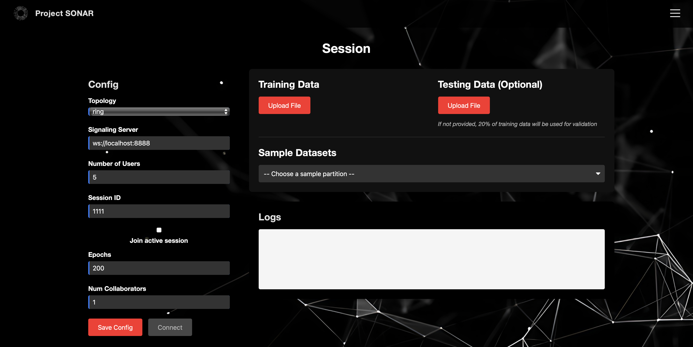
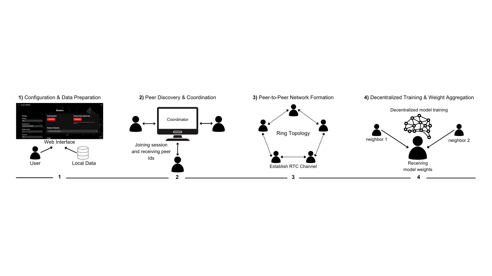

[](https://github.com/psf/black)
[](https://aidecentralized.github.io/sonar/)

# SONAR Web: A Framework for Cross-Platform Decentralized Learning  
**FLEdge-AI 2025 Submission Branch**  
This branch (`fledge2025-submission`) corresponds to our paper submission to the FLEdge-AI 2025 workshop. It includes the implementation and demo environment used for evaluation.

---

## Overview

**SONAR Web** (Self-Organizing Network of Aggregated Representations) is an open-source framework that enables real-time, privacy-preserving, decentralized training of neural networks across heterogeneous platforms, including:

- Web browsers (TensorFlow.js)
- Python-based desktop clients
- Mobile devices (via browser interface)

The system operates without a centralized server or coordinator, relying on peer-to-peer communication to enable learning over edge devices while preserving strict data locality.

Full documentation: [https://aidecentralized.github.io/sonar/](https://aidecentralized.github.io/sonar/)

---

## Live Demo

Try SONAR Web in action:  
https://sonar-web.onrender.com/

Note: This server may experience spin-up latency or downtime due to free-tier hosting.



---

## Quick Start Instructions

### 1. Run Python Signaling Server
```bash
pip install -r requirements.txt
python src/rtc_server.py
```

### 2. Launch Browser Client
```bash
cd src/browser_client
npm install
npm run dev
```
Then open the provided `localhost` link in your browser.

---

## System Architecture



SONAR Web is built with modularity and extensibility in mind. It consists of the following core modules:

1. Lightweight peer discovery and session coordination
2. Unified communication layer abstracting WebRTC/WebSocket differences
3. Platform-agnostic configuration interface
4. Federated-style training and monitoring pipeline across clients

### Design Goals

- **Modular and Extensible** — Plug-and-play components for rapid research iteration  
- **Cross-Platform** — Browser, Node.js, and Python-based client support  
- **Fully Decentralized** — No centralized coordinator; only peer-to-peer  
- **Low Barrier to Entry** — Lightweight dependencies and minimal setup  

---

## Key Features

- Real-time peer-to-peer model training using WebRTC
- Seamless interoperability between Python, browser, and mobile clients
- TensorFlow.js support for in-browser neural network training
- Dynamic peer registration and session-based coordination
- Simple setup and deployment for research or demo use

---

## Contribution

We welcome feedback and contributions.

To contribute:
1. Clone this repo and create a new branch
2. Follow the system modularity guide in the [documentation](https://aidecentralized.github.io/sonar/)
3. Submit a pull request with a brief explanation

---

## Directory Reference (For Reviewers)

| Path | Description |
|------|-------------|
| `src/rtc_server.py` | Python signaling and orchestration server |
| `src/browser_client/` | Browser client built with TensorFlow.js |
| `docs/` | Architecture diagrams and system overview assets |

---

For questions, please open an issue on this repo: https://github.com/aidecentralized/sonar/issues