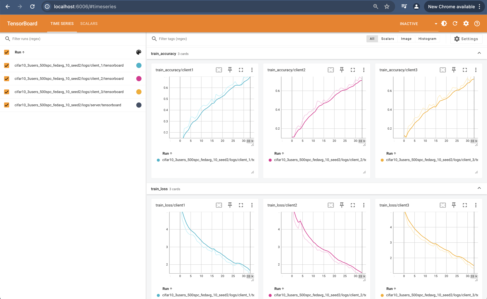
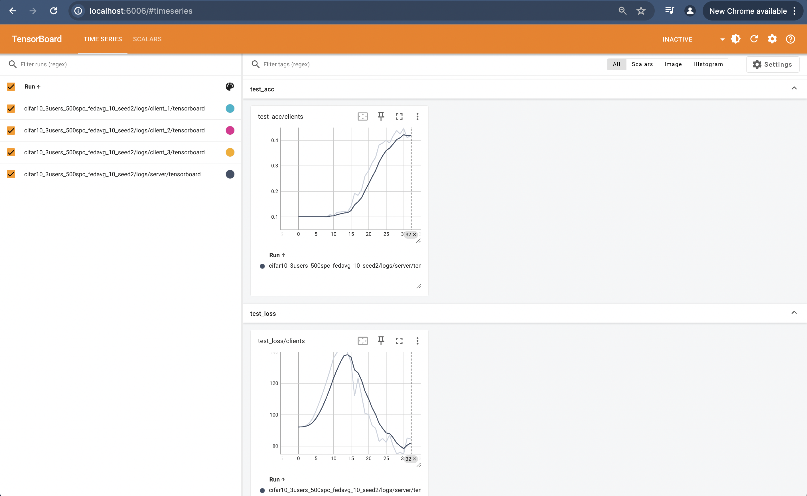

### Running the code
With the current configs, the following command will work off-the-shelf
`mpirun -np 4 -host localhost:4 python main.py`

Let's say you want to run the model training of 10 nodes on a machine. That means there will be 11 nodes in total because there is 1 extra node in addition to the clients --- server.
The whole point of this project is to eventually transition to a distributed system where each node can be a separate machine and a server is simply another node. But for now, this is how things are done.

You can execute the 10 node simulation by running the following command: 
`mpirun -np 10 -host localhost:11 python main.py`

Depending on the environment you're running the experiment on, you may have to update the config files based on the number of GPUs available. Refer to the [Config file](#config-file) section for more information.

### Config file
The config file is the most important file when running the code. Always be sure of what config you are using. Our `main.py` file uses a combination of `algo_config.py` and `sys_config.py` by default. These files can have multiple configurations defined within them and the provision to select one as default. 

We have intentionally kept configuration files as a python file which is typically a big red flag in software engineering. But we did this because it enables plenty of quick automations and flexibility. Be very careful with the config file because it is easy to overlook some of the configurations such as device ids, number of clients etc.

### Reproducibility
One of the awesome things about this project is that whenever you run an experiment, all the source code, logs, and model weights are saved in a separate folder. This is done to ensure that you can reproduce the results by looking at the code that was responsible for the results. The naming of the folder is based on the keys inside the config file. That also means you can not run the same experiment again without renaming/deleting the previous experimental run. The code automatically asks you to press `r` to remove and create a new folder. Be careful you are not overwriting someone else's results.

### Logging
We log metrics such as loss, accuracy along with other client-server synchronization details in log file and in tensorboard.
For detail check [Logging](../docs/Logging.md)

The tensorboard logs can be viewed by running tensorboard as follows: 
`tensorboard --logdir=expt_dump/ --host 0.0.0.0` 
Assuming `expt_dump` is the folder where the experiment logs are stored.

After a successful run with 30 epochs, the Tensorboard experiment log displays the following Client Metrics and Server Metrics on the local host:

Client Metrics

Server Metrics

### Flow of the code
1. First all the nodes start independently as a python process.
2. Then we "install" the config. This is just an indirection for processing the config file. Later on we might do other things like setting up the environment etc.
3. Then `initialize` is called for the scheduler that performs a lot of setup tasks so let's discuss it in detail.
3.1 First it initializes a Communication object which is responsible for all the communication between the nodes. For gRPC communication interface, the communication manager waits until the super-node is available and gives it a unique rank and "quorum" to be set. The latter means every node will wait until the super-node sends the list of all nodes that have registered with it. The super-node sends this list when all the nodes have registered with it. Later on, we might change this to a more dynamic system where nodes can join and leave the system at any time.
3.2 Then we merge the configs. The reason we did not merge the configs before is because communication manager is the one who provides each node a rank and the algorithm config can be different for different nodes. So we merge the configs here.
3.3 