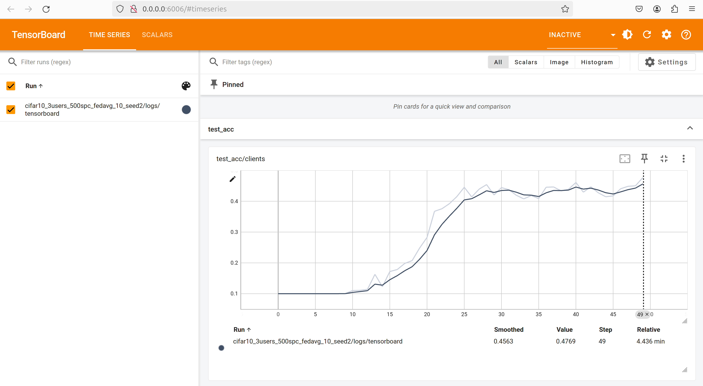

## Setting Up the Project with Docker

### Prerequisites

Ensure you have Docker installed on your machine. You can download it from [Docker's official website](https://www.docker.com/get-started).

### Building the Docker Image

1. Clone the repository:
    ```sh
    git clone https://github.com/aidecentralized/sonar
    cd sonar
    ```

2. Build the Docker image:
    ```sh
    docker build -t sonar_image:latest .
    ```

### Running the Container

We provide a `docker_run.sh` script to simplify running the Docker container.

1. Ensure the script has execution permissions:
    ```sh
    chmod +x docker_run.sh
    ```

2. Run the script:
- Using './':
    ```sh
    ./docker_run.sh
    ```
- Using 'bash':
    ```sh
    bash docker_run.sh
    ```

The `docker_run.sh` script will handle the necessary Docker commands to start the container with the appropriate settings.

Note: If you have used a different Image name while building Docker Image, Please update the name accordingly in `docker_run.sh` script

### Running the code
Let's say you want to run the model training of 3 nodes on a machine. That means there will be 4 nodes in total because there is 1 more node in addition to the clients --- server.
The whole point of this project is to eventually transition to a distributed system where each node can be a separate machine and a server is simply another node. But for now, this is how things are done.

You can execute the 3 node simulation by running the following command:<br>
`mpirun -np 4 -host localhost:11 python main.py`

Depending on the environment you're running the experiment on, you may have to update the config files based on the number of GPUs available. Refer to the [Config file](#config-file) section for more information.


### Config file
The config file is the most important file when running the code. Always be sure of what config you are using. Our `main.py` file uses a combination of `algo_config.py` and `sys_config.py` by default. These files can have multiple configurations defined within them and the provision to select one as default. 

We have intentionally kept configuration files as a python file which is typically a big red flag in software engineering. But we did this because it enables plenty of quick automations and flexibility. Be very careful with the config file because it is easy to overlook some of the configurations such as device ids, number of clients etc.

### Reproducibility
One of the awesome things about this project is that whenever you run an experiment, all the source code, logs, and model weights are saved in a separate folder. This is done to ensure that you can reproduce the results by looking at the code that was responsible for the results. The naming of the folder is based on the keys inside the config file. That also means you can not run the same experiment again without renaming/deleting the previous experimental run. The code automatically asks you to press `r` to remove and create a new folder. Be careful you are not overwriting someone else's results.

### Logging
We log the results in the console and also in a log file that captures the same information. We also log a few metrics for the tensorboard. 

The tensorboard logs can be viewed by running tensorboard as follows:<br>
`tensorboard --logdir=expt_dump/ --host 0.0.0.0`<br>
Assuming `expt_dump` is the folder where the experiment logs are stored.

After a successful run with 50 epochs, the Tensorboard experiment log should look something like below:


